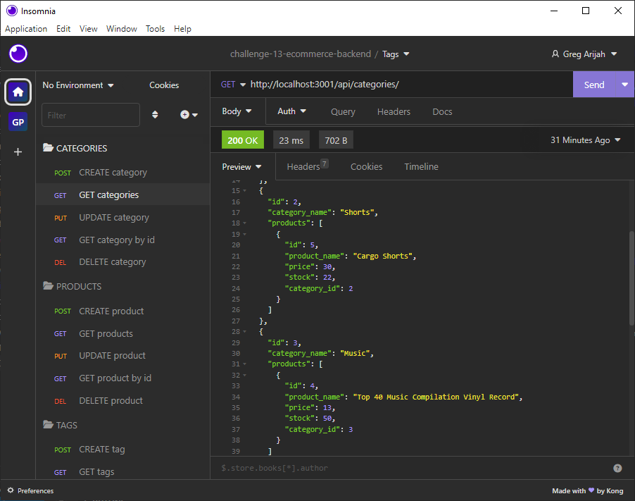
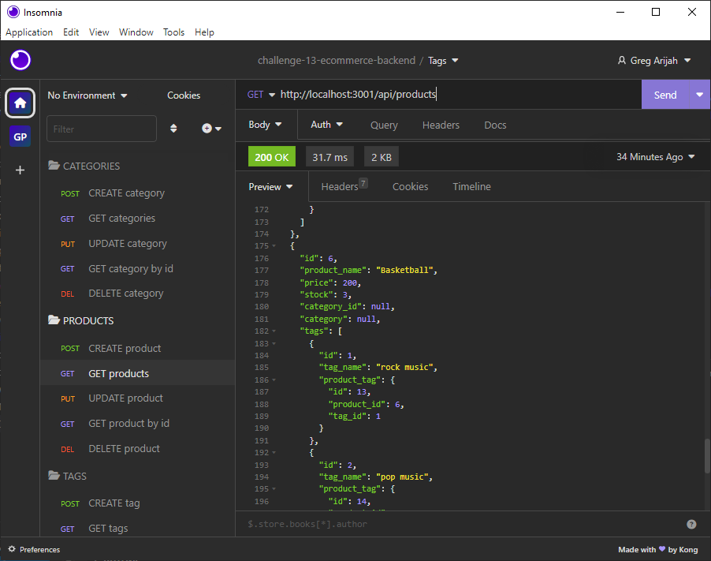
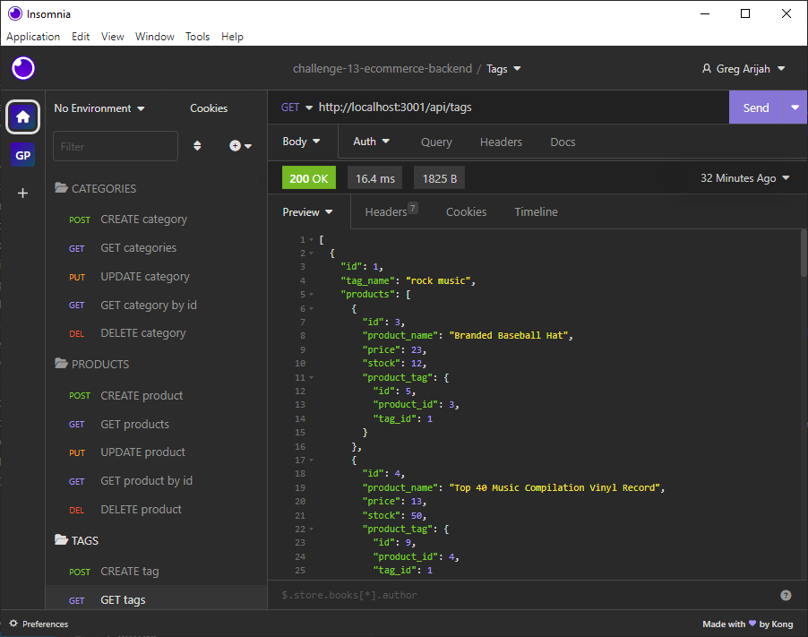

# E-commerce Back End 
	

## Description

This app is a restful api which uses Sequelize an an ORM for managing catgories, products and tags; allowing users to perform CRUD operations.

## Table of Contents

- [Installation](#installation)
- [Walkthrough](#walkthrough)
- [Usage](#usage)
- [License](#license)
- [Badges](#badges)
- [Questions](#questions)
- [Screenshots](#screenshots)

## Installation

To use this application - After downloading or cloning the repository and navigating to the correct folder using the command line, type "npm i" to install dependencies, then login to sql and initialize the database then type  "npm run seed" to seed to database, then type "npm run" to start the server.

## Walkthrough

[Click here to follow a walkthrough video describing the functionality of the app.](https://drive.google.com/file/d/1GUHcmWtSXxZi5MqFKBizJhMTyS2hSbhb/view)

## Usage

Use insomnia or other api client to test backend routes.

## License

This project is licensed under the terms of the [MIT License](https://choosealicense.com/licenses/mit/).

## Badges

     

## Questions

GitHub: [gregarijah](https://github.com/gregarijah) 

## Screenshots

